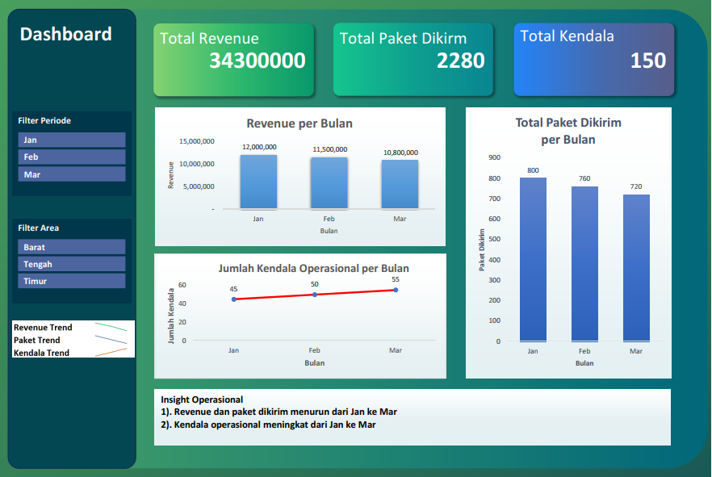

Project Overview:
This project presents an interactive Excel dashboard built to visualize the monthly performance of KirimCepat's local delivery fleet. The dashboard was developed using PivotTable, PivotChart, Slicer, Sparkline, and Conditional Formatting to support operational monitoring and decision-making.

Tools & Features Used:
- Microsoft Excel
- PivotTable
- PivotChart
- Slicer (Area & Month filter)
- Sparkline (Revenue & Shipment trends)
- Conditional Formatting (Performance indicators)
- Insight Textbox for business interpretation

Dashboard Preview:

